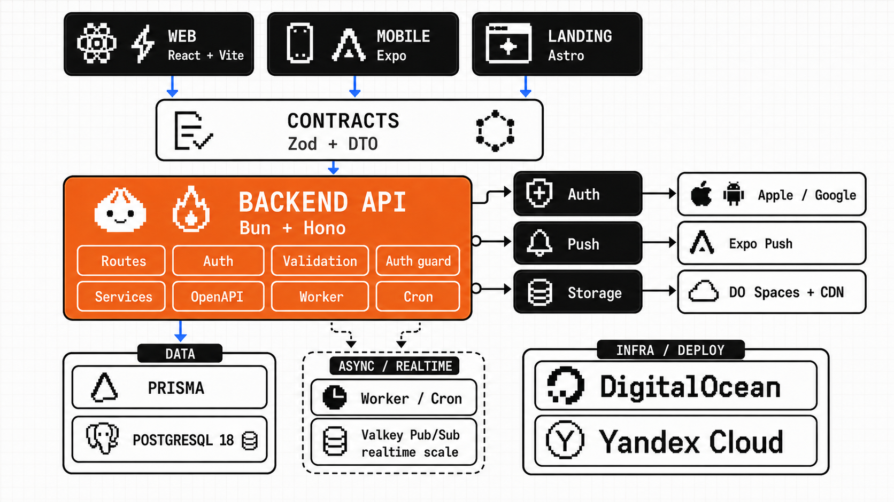

# Vibe Coding Template

<p align="center">
  
</p>

A full-stack starter for web and backend products: one repository with a Bun/Hono backend, a React CSR browser client (`webapp`), an Astro SSG/SSR site (`website`), and shared API contracts. The runnable Expo mobile template lives on the `mobile` branch so the default branch stays focused on webapp, backend, website, infrastructure, and shared contracts.

## Agent Intake Checklist Before Installing

Before cloning or installing this template for an end user, the agent should ask a short product-focused intake in the user's language and record the answers during setup:

- Confirm whether this is a new project from the template or work on the template itself.
- Ask for the project name/slug and the user's own GitHub destination, if they already have one.
- Ask what product they want to build first and the first user journey that should work.
- Ask which surfaces are active now: `webapp`, `mobile`, `backend/API`, `website`, or full-stack. Mark the rest as deferred.
- Route each browser feature by SEO need, not by habit: public, search-indexable, or link-previewed pages (landing, content, marketplace catalog) belong in `website` (Astro SSG first; SSR/hybrid only for request-specific routes); behind-login app screens with no SEO belong in `webapp` (CSR). See "Choosing `webapp` vs `website`". The user usually will not know this distinction, so decide it for them and explain it in product terms.
- If `mobile` is active, clone or checkout the `mobile` branch before setup; that branch is the mobile-ready template line with payments, Expo Push, and mobile-specific release/setup foundation.
- Ask whether the first version needs accounts/auth, persistence, file uploads, images/media, payments, admin tools, or external integrations.
- Ask whether the product needs real-time collaboration, chat, presence, live notifications, or other WebSocket-style updates.
- If `mobile` is active, switch to the `mobile` branch before setup and ask whether Expo/EAS builds and Maestro E2E validation are needed now or can be left unconfigured until later.
- For files/images/media, ask whether assets are public or private, what users upload, expected max file size, allowed file types, whether thumbnails/optimized variants are needed, and when files should be deleted.
- Ask whether deployment is needed now. If yes, use DigitalOcean by default and ask for production domains/URLs and release targets, not for a cloud provider choice.
- For DigitalOcean deployment, verify App Platform GitHub integration first, then generate specs with `bun run deploy:do:specs`; never hand-substitute secrets or URLs into app specs.
- If the user explicitly asks for Yandex Cloud, follow [docs/YANDEX_CLOUD.md](docs/YANDEX_CLOUD.md) instead of improvising provider choices.
- If backend/API, full-stack, uploads, or database-backed validation is active, verify Docker Compose and the Docker daemon before local setup.

## Agent Repo Download Instructions

When installing this repository from a GitHub URL into a fresh Codex or agent session, treat setup as an onboarding task before feature work. This README is the source of truth for first-run setup because fresh installers may not read `AGENTS.md`.

Give the agent this initial prompt:

```text
Install this repository into the project. Before cloning from a GitHub URL, ask whether I plan to develop a mobile app now. If yes, clone the `mobile` branch with `git clone --branch mobile --single-branch <repo-url>` or checkout `mobile` immediately after cloning; that branch is the mobile-ready template line with Expo, payments, Expo Push, social auth, and mobile-specific release/setup foundation. If mobile is deferred, use the default branch; it intentionally contains only `mobile/README.md` as a pointer to the mobile template branch. First read README.md, CLAUDE.md if present, and relevant docs/*.md, including docs/LOCAL_DATABASE.md when backend/API or full-stack work is active, docs/STORAGE.md when uploads, files, images, or media are active, and docs/YANDEX_CLOUD.md only when I explicitly ask for Yandex Cloud. Before setup, ask me what project name/slug I want to use, what product I want to build first, which surfaces I need now (webapp, mobile, backend/API, website, or full-stack), whether the first version needs auth/persistence/uploads/media/integrations, whether it needs real-time chat/presence/live updates, and whether I need deployment now. If mobile is active, confirm the checkout is on the `mobile` branch before running mobile setup, then follow that branch's README for Expo/EAS, Maestro, IAP, push, and social auth setup. Prefer the monolithic backend in this repository; do not introduce microservices during setup. If real-time features later need horizontal scaling across multiple backend instances, use managed Redis-compatible Pub/Sub such as DigitalOcean Managed Valkey or Yandex Managed Service for Valkey to fan out events between WebSocket connections. If deployment is needed, use DigitalOcean App Platform, DigitalOcean Managed PostgreSQL, and DigitalOcean Spaces by default; ask me for production domains/URLs and release targets, but do not ask me to choose a cloud provider unless I explicitly request another provider. For DigitalOcean deployment, first verify that App Platform is connected to my GitHub account/organization and has access to the full monorepo branch, then generate concrete specs with `bun run deploy:do:specs` into `.scratch/deploy`; do not use manual `sed`, `perl`, or shell substitution for secrets, CORS origins, `VITE_API_URL`, or `PUBLIC_WEBAPP_URL`. If I explicitly request Yandex Cloud, use Yandex Serverless Containers, Yandex Managed Service for PostgreSQL, Yandex Object Storage, and Yandex Cloud CDN according to docs/YANDEX_CLOUD.md. If backend/API, full-stack, uploads, or any database-backed validation is active, verify Docker Compose with `docker compose version` and the Docker daemon with `docker info`; if Docker is missing or not running, explain how to install/start it for my OS before continuing. Treat this checkout as a new project by default, not as a pull request back to the template: detach the original template remote unless I explicitly say I am contributing to the template, and add my own GitHub remote only if I provide one or ask you to create/publish it. Rename package.json and other repository-specific identifiers to the chosen project name where applicable. After first-run setup is complete, delete the marked Bootstrap-Only Instructions blocks from AGENTS.md and CLAUDE.md. Use Docker Compose for local PostgreSQL on Windows, macOS, and Linux; do not require native PostgreSQL or cloud credentials for local development.
```

- First read `README.md`, `CLAUDE.md` if present, and relevant `docs/*.md`, then inspect package scripts and `.env.example` files before running setup commands.
- Inspect `git remote -v` before any branch, commit, push, or PR workflow. If `origin` points to the template repository and the user has not explicitly said they are contributing to the template, treat this as a new project and detach from the template remote with `git remote remove origin`.
- If the user provides their own GitHub repository URL or asks to publish the new project, add that URL as the new `origin` after the template remote is removed. If the user has not chosen a destination yet, leave the repository with no `origin` and report that publishing is not configured.
- Do not open pull requests against the template repository during first-run project setup. Ask only if the user explicitly says this checkout is for improving the template itself.
- Ask the user a short intake in the user's language before making product or deployment choices:
  - what project name/slug to use;
  - what product or app they want to build first;
  - which surfaces are active now: webapp, mobile, backend/API, website, or full-stack;
  - if mobile is active, whether the checkout is already on the `mobile` branch; if not, switch to `mobile` before setup;
  - whether the first version needs accounts/auth, persistence, uploads/files/images/media, payments, admin tools, or external integrations;
  - whether real-time chat, presence, collaboration, live notifications, or WebSocket-style updates are needed now;
  - whether Expo/EAS builds and Maestro E2E validation are needed now when mobile is active;
  - whether deployment is needed now, and if yes, the production domains/URLs and release targets.
- After the user answers, record durable project choices in the relevant README sections before feature work: project name/slug, active surfaces, deferred surfaces, validation scope, and what deployment/release work is in or out of scope. Once setup is complete, remove the marked `Bootstrap-Only Instructions` blocks from `AGENTS.md` and `CLAUDE.md`.
- If only the webapp is active, keep mobile deferred on the default branch: do not run Expo/EAS/Maestro setup and do not add mobile features. When the user later asks for mobile, switch to the `mobile` branch first.
- If only the mobile app is active, keep webapp and website intact but deferred: do not add browser-only features or Playwright flows unless they support the active mobile/backend work, and add or update a short deferred-surface note in `webapp/README.md` or `website/README.md` as relevant. When the user later asks for webapp, remove or rewrite that note, then set up and validate webapp normally.
- On the `mobile` branch, keep template-level Expo/EAS config universal. Do not commit an `expo.owner` or `extra.eas.projectId` to the template. In an installed project, write `expo.owner` and run EAS project init only after the user selects the real Expo personal account or organization that should own the app.
- On the `mobile` branch, use an installed Expo development build for Maestro E2E, not Expo Go. Follow that branch's mobile README before running mobile flows.
- Prefer README-level deferred-surface notes over source-code comments. Add code comments only when a dormant code path would otherwise mislead future work.
- Default to local-only setup when the user does not need deployment yet. Local development must not require DigitalOcean credentials.
- Use [docs/LOCAL_DATABASE.md](docs/LOCAL_DATABASE.md) and `docker-compose.yml` as the local PostgreSQL source of truth. The default local database path is Docker Compose, not a native PostgreSQL install.
- If deployment is requested, use DigitalOcean App Platform as the supported production path. Use DigitalOcean Managed PostgreSQL for production databases; do not use App Platform dev databases for production.
- For the default DigitalOcean production backend/API service, start with one `apps-s-1vcpu-1gb` App Platform container (`instance_count: 1`) plus the smallest DigitalOcean Managed PostgreSQL production cluster. This keeps the initial backend and database infrastructure around $27/month before taxes, traffic overages, storage, and optional add-ons. `webapp` and fully prerendered `website` output are Static Sites and do not need runtime container sizing. A `website` route with SSR/on-demand rendering or server islands needs a runtime service.
- Deploy `webapp` and fully prerendered `website` output as DigitalOcean App Platform Static Sites, not App Platform services. They do not get `instance_size_slug` or `instance_count`; static site assets are served through DigitalOcean's global CDN by default. Use an external CDN only when the product needs advanced controls such as bot filtering, custom rate limiting, or geographic traffic rules.
- For DigitalOcean app specs, use committed `.do/*.yaml.example` templates plus `bun run deploy:do:specs`; generated specs stay in `.scratch/deploy` and must fail on empty values or unresolved placeholders before `doctl apps create`. Concrete App Platform machine defaults live in `scripts/prepare-do-specs.mjs`; update that script and [docs/DEPLOYMENT.md](docs/DEPLOYMENT.md) together when changing infrastructure tiers.
- Before deployment or cloud-resource updates, verify `git remote -v` and `git status --short --branch`. Deploy only from the intended pushed release branch with a clean worktree; if local changes, untracked files, or branch sync issues are present, stop instead of cleaning, stashing, resetting, or checking out over another session's work.
- Use DigitalOcean Spaces Standard Storage plus Spaces CDN for persistent files, uploads, and public media. Do not store uploads on the App Platform container filesystem.
- If the user explicitly chooses Yandex Cloud, use [docs/YANDEX_CLOUD.md](docs/YANDEX_CLOUD.md): Serverless Containers for backend/API, Managed Service for PostgreSQL for production data, Object Storage for files/static sites, and Cloud CDN for public static/media delivery.
- Explain manual prerequisites only for the active release path: DigitalOcean account, billing/project setup, `doctl auth init`, registry access when using DigitalOcean Container Registry, DigitalOcean Managed PostgreSQL, and production domains/DNS. Expo/EAS/App Store/Google Play setup lives on the `mobile` branch.
- The agent may create uncommitted local `.env` files from `.env.example` and generate a local-only `JWT_SECRET`; never commit secrets or print raw secrets in the final report.
- After setup, run the smallest meaningful validation for the chosen active surfaces and report local URLs, commands run, and anything the user still needs to authorize manually.

## What's Inside

- `backend` - Bun + Hono + Prisma + PostgreSQL, custom JWT auth, Zod validation, and OpenAPI output.
- `webapp` - React + Vite + TanStack Query/Form/Router CSR browser client with the baseline auth flow.
- `website` - a separate Astro project for public SSG/SSR pages (landing, content sites, marketplace).
- `mobile/README.md` - pointer to the runnable Expo mobile template on the `mobile` branch.
- `packages/contracts` - shared Zod schemas and TypeScript API types.
- `.do` - committed DigitalOcean App Platform spec templates; generate concrete specs into `.scratch/deploy` with `bun run deploy:do:specs`.
- `docker-compose.yml` - local PostgreSQL 18 through the official `postgres:18-alpine` image on port `54329`; test runners use a repository-derived port by default, or `POSTGRES_TEST_PORT` when set. PostgreSQL 18 is intentional because the backend schema uses strict database-generated UUIDv7 IDs.
- `docs/TESTING.md` - the backend and Playwright testing contract. Mobile Maestro guidance lives on the `mobile` branch.
- `docs/LOCAL_DATABASE.md` - cross-platform local PostgreSQL setup for Windows, macOS, and Linux.
- `docs/STORAGE.md` - DigitalOcean Spaces, CDN, uploads, and image/media storage rules.
- `docs/YANDEX_CLOUD.md` - optional Yandex Cloud deployment path when the user explicitly chooses it.

## Choosing `webapp` vs `website`

This template ships two browser surfaces. Putting a feature in the wrong one is the most common early mistake, so the installing agent must pick deliberately and explain the choice in product terms the user understands.

- Build it in **`website`** (Astro, static by default, SSR/hybrid only when needed) when pages must be **public and found by search engines or shared with rich link previews**: marketing/landing pages, content sites, blogs, docs, and the public storefront of a **marketplace**. For a marketplace, this usually means the landing page, category/search landing pages, public listing/product pages, SEO metadata, and rich previews.
- Build it in **`webapp`** (React, client-side rendered) when screens live **behind sign-in and do not need SEO**: login-adjacent app flows after redirect, buyer account, seller/admin panels, checkout/account workflows, dashboards, settings, and authenticated tools. No crawler needs these, so CSR is the simpler, cheaper choice.

Rule of thumb for the agent: *if a page must rank in search or preview nicely when shared, it belongs in `website`; if it is only reachable after login, it belongs in `webapp`.* Real marketplaces normally use **both**: the public catalog lives in `website`, the authenticated app lives in `webapp`, and both reuse the same `@web-app-demo/contracts` schemas. Do not rebuild SEO pages inside `webapp` to "keep everything in one app"; that loses the SEO the product needs. Do not move the full authenticated app into Astro just because the product has public SEO pages.

Astro stays the default website stack for this template because it is content-first, static-first, ships little JavaScript by default, and gives agents a clear SEO surface. Choose Next.js only when the project intentionally wants a Vercel-optimized ISR/cache platform as a core product requirement. Treat TanStack Start as an optional future React full-stack path for teams that want one React app with selective SSR; it is not the simple default for non-programmer vibe-coding projects.

## Quick Start

Install dependencies first:

```bash
bun install
```

If backend/API, full-stack, or other database-backed work is active, check Docker first. Docker is the local app that runs PostgreSQL for this template:

```bash
docker compose version
docker info
```

If either command fails, install and start Docker before continuing:

- Windows: install Docker Desktop, enable the WSL 2 backend, start Docker Desktop, then rerun `docker compose version` and `docker info`.
- macOS: install and start Docker Desktop, or another Docker Engine with Compose v2, then rerun `docker compose version` and `docker info`.
- Linux: install Docker Engine and the Docker Compose plugin, start the Docker service, then rerun `docker compose version` and `docker info`.

Do not switch new users to native PostgreSQL during local setup. The repository's documented local path is Docker Compose for backend/API work.

### Backend/API Or Full-Stack

Only run this block when backend/API, full-stack, or DB-backed validation is active.

```bash
docker compose pull postgres
docker compose up -d postgres
```

Create the backend env file:

```bash
# macOS, Linux, or Git Bash on Windows
cp backend/.env.example backend/.env
```

```powershell
# Windows PowerShell
Copy-Item backend/.env.example backend/.env
```

Then apply migrations:

```bash
bun run --cwd backend prisma:migrate
```

### Run The Active Surfaces

Start only the app surfaces you need in separate terminals:

```bash
bun run dev:backend
bun run dev:webapp
bun run dev:website
```

Webapp-only or website-only setups can skip the backend/PostgreSQL block until backend/API becomes active.

Create `webapp/.env` when the browser client should use a non-default API URL:

```bash
VITE_API_URL=http://localhost:3000
```

Test runners use the separate Docker Compose `postgres_test` service and the `TEST_DATABASE_URL` shape from `.env.example`/`backend/.env.example`. Webapp Playwright E2E starts `postgres_test`, applies migrations to `web_app_demo_test`, runs the browser flow, and tears down its test database volume by default.

## Workspace Commands

- `bun run dev` - start all workspace projects in parallel dev mode.
- `bun run dev:backend` - start the backend API.
- `bun run dev:webapp` - start the Vite CSR webapp.
- `bun run dev:website` - start the Astro website project.
- `bun run typecheck` - run TypeScript checks across workspaces.
- `bun run build` - run production build/typecheck/export scripts for workspaces that define them.
- `bun run test` - run contract, backend, and webapp unit/integration tests.
- `bun run test:contracts` - run shared Zod contract tests.
- `bun run test:backend` - run backend unit and integration tests.
- `bun run test:backend:integration` - run DB-backed auth tests through `postgres_test`.
- `bun run test:webapp` - run webapp client tests.
- `bun run deploy:do:specs` - safely generate concrete DigitalOcean specs under `.scratch/deploy`.
- `bun run e2e:webapp` - run the Playwright auth smoke test through backend + Vite.
- `bun run --cwd backend prisma:migrate` - create/apply a Prisma migration in development.
- `bun run --cwd backend prisma:deploy` - apply existing Prisma migrations on a server.

## Project READMEs

- [backend/README.md](backend/README.md) - API, auth, Prisma, and backend validation.
- [docs/LOCAL_DATABASE.md](docs/LOCAL_DATABASE.md) - Docker Compose PostgreSQL setup and reset workflow.
- [docs/STORAGE.md](docs/STORAGE.md) - DigitalOcean Spaces, CDN, uploads, and image/media storage rules.
- [docs/YANDEX_CLOUD.md](docs/YANDEX_CLOUD.md) - optional Yandex Cloud deployment path when explicitly selected.
- [webapp/README.md](webapp/README.md) - CSR browser client setup, env, and Playwright smoke.
- [mobile/README.md](mobile/README.md) - pointer to the full mobile template branch.
- [website/README.md](website/README.md) - Astro website commands, hybrid rendering, and publishing model.
- [packages/contracts/README.md](packages/contracts/README.md) - shared schema and DTO rules.

## License

This project is licensed under the Apache License 2.0. If you distribute a fork, copy, or derivative work, keep both [LICENSE](LICENSE) and [NOTICE](NOTICE) with the attribution to Dima Sukharev, GitHub profile, and the original repository.

## Architecture Notes

API contracts live in `packages/contracts` and are imported by every active layer. The backend validates input with those Zod schemas, and the webapp client reuses the same schemas in TanStack Form and API calls. The `mobile` branch extends the same contract model for Expo.

The backend API flow is `route -> validation -> auth/session guard -> service -> Prisma -> DTO`. Routes stay thin, auth business logic lives in the feature service, and API, worker, and cron entrypoints share `src/runtime.ts` for env and Prisma setup.

Keep the default architecture monolithic. For DigitalOcean production, the backend/API default is one `apps-s-1vcpu-1gb` App Platform container so a new project starts inside the expected low-cost budget with Managed PostgreSQL while retaining a clear scale-up path. Add backend worker or scheduled-job components from the same Docker image only when a concrete background or periodic task exists; the deployment generator refuses to deploy the empty worker placeholder. For real-time features, a single backend instance can own its local WebSocket connections. If the backend is horizontally scaled and users connected to different instances must receive the same chat, presence, or live events, add a managed Redis-compatible Pub/Sub broker between instances, using DigitalOcean Managed Valkey on the default path or Yandex Managed Service for Valkey when Yandex Cloud is explicitly selected.

Ongoing engineering guidance lives in [AGENTS.md](AGENTS.md), [CLAUDE.md](CLAUDE.md), [docs/ARCHITECTURE.md](docs/ARCHITECTURE.md), [docs/TESTING.md](docs/TESTING.md), and [docs/DEPLOYMENT.md](docs/DEPLOYMENT.md). First-run download and product setup instructions live in this README.

## Current Upstream Documentation

For framework, API, deployment, or testing questions, consult the current upstream documentation linked here first. The repository docs describe this template's conventions; the linked docs are the authoritative source for tool behavior and provider-specific changes.

- Runtime and package manager: [Bun docs](https://bun.sh/docs)
- Backend framework: [Hono docs](https://hono.dev/docs)
- Database ORM: [Prisma docs](https://www.prisma.io/docs) and [PostgreSQL docs](https://www.postgresql.org/docs/)
- Validation and contracts: [Zod docs](https://zod.dev/)
- JWT library: [jose documentation](https://github.com/panva/jose)
- Web stack: [React docs](https://react.dev/reference/react), [Vite guide](https://vite.dev/guide/), [TanStack Query](https://tanstack.com/query/latest/docs/framework/react/overview), [TanStack Form](https://tanstack.com/form/latest/docs/framework/react/quick-start), and [TanStack Router](https://tanstack.com/router/latest/docs/overview)
- Testing: [Playwright docs](https://playwright.dev/docs/intro)
- Website: [Astro docs](https://docs.astro.build/en/getting-started/)
- Local infrastructure: [Docker Compose docs](https://docs.docker.com/compose/) and [PostgreSQL Docker Official Image](https://hub.docker.com/_/postgres)
- Deployment and storage: [DigitalOcean App Platform](https://docs.digitalocean.com/products/app-platform/), [DigitalOcean App specs](https://docs.digitalocean.com/products/app-platform/reference/app-spec/), [DigitalOcean Static Sites](https://docs.digitalocean.com/products/app-platform/how-to/manage-static-sites/), [DigitalOcean Managed Databases in App Platform](https://docs.digitalocean.com/products/app-platform/how-to/manage-databases/), [DigitalOcean Valkey](https://docs.digitalocean.com/products/databases/valkey/), [DigitalOcean Dockerfile builds](https://docs.digitalocean.com/products/app-platform/reference/dockerfile/), [DigitalOcean Bun buildpack](https://docs.digitalocean.com/products/app-platform/reference/buildpacks/bun/), [doctl](https://docs.digitalocean.com/reference/doctl/), [doctl apps spec validate](https://docs.digitalocean.com/reference/doctl/reference/apps/spec/validate/), [DigitalOcean Container Registry](https://docs.digitalocean.com/products/container-registry/), [DigitalOcean Spaces](https://docs.digitalocean.com/products/spaces/), [DigitalOcean Spaces CDN](https://docs.digitalocean.com/products/spaces/how-to/enable-cdn/), and [external CDN in front of App Platform](https://docs.digitalocean.com/products/app-platform/how-to/configure-external-cdn/)
- Optional Yandex Cloud path: [Yandex Cloud CLI](https://yandex.cloud/en/docs/cli/quickstart), [Yandex Serverless Containers](https://yandex.cloud/en/docs/serverless-containers/), [Yandex Container Registry](https://yandex.cloud/en/docs/container-registry/quickstart), [Yandex Managed PostgreSQL](https://yandex.cloud/en/docs/managed-postgresql/), [Yandex Managed Service for Valkey](https://yandex.cloud/en/docs/managed-redis/), [Yandex Object Storage static hosting](https://yandex.cloud/en/docs/storage/operations/hosting/setup), [Yandex Object Storage AWS CLI](https://yandex.cloud/en/docs/storage/tools/aws-cli), [Yandex Cloud CDN](https://yandex.cloud/en/docs/cdn/concepts/), and [Yandex Cloud Marketplace Image Resizer](https://yandex.cloud/en/marketplace/products/yc/image-resizer)
